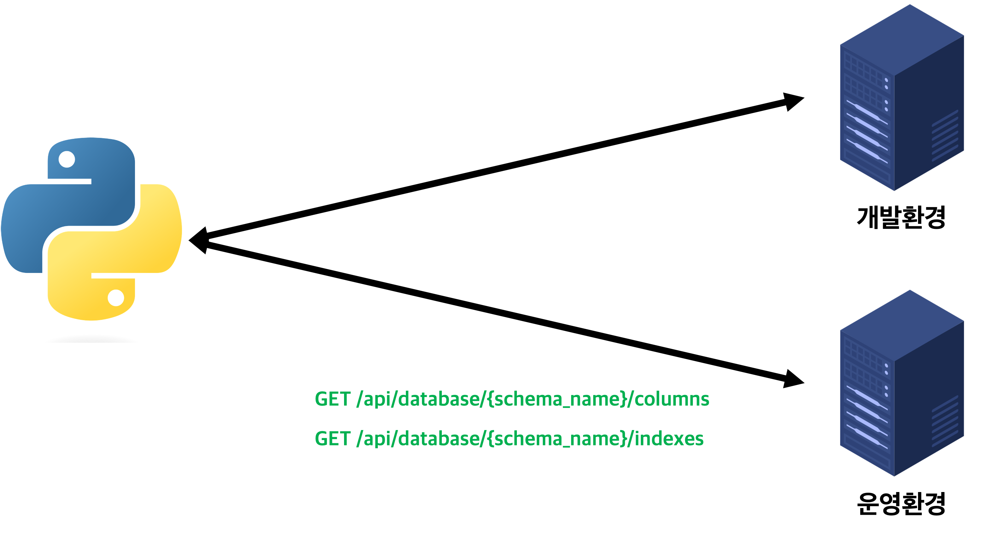

# 개요
개인적으로 Development, Production 환경이 구별되어 있으나, flyway와 같은 데이터베이스 마이그레이션 툴을 사용하지 않아 두 환경의 컬럼 속성이나 인덱스 유무에 차이가 있어 이로 인한 문제를 경험한적이 있습니다.
당시에 이러한 문제를 예방하기 위해 작성했던 코드의 일부로, postgres에만 유효한 것으로 알고 있으며 information-schema를 jpa로 접근하는 방식이 신선해서 재미있었습니다.

# 구조
이 문제를 해결하기 위해 생각했던 방법은 다음과 같았습니다. 서로 다른 환경에서 서로 다른 데이터베이스를 바라보고 있는 두 서버가 자신이 바라보고 있는 데이터베이스의 테이블, 컬럼, 인덱스 등의 정보를 반환하도록 합니다.
그리고 나서 AWS Lambda 등을 통해 주기적으로 파이썬 코드를 실행시켜 두 환경에서 반환한 결과를 비교하고 차이가 있는 경우 이를 사전에 조치하는 것이었습니다.


# 참고
아래 경로에 예시 스크립트가 있습니다.
```sh
/postgres-schema-monitor/application/src/main/resources/python/columns-diff.py
/postgres-schema-monitor/application/src/main/resources/python/indexes-diff.py
```

실행 전에 아래와 같이 관련 의존성을 설치하여야 합니다.
```sh
python3 -m pip install -r /postgres-schema-monitor/application/src/main/resources/python/requirements.txt
```
